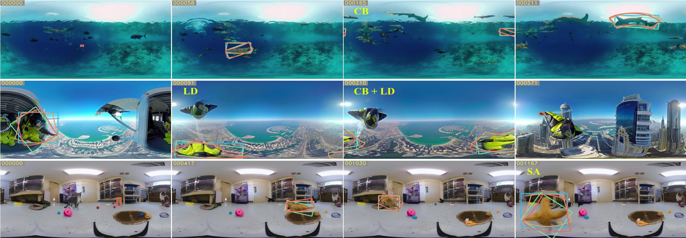

# 360VOT: A New Benchmark Dataset for Omnidirectional Visual Object Tracking
Huajian Huang, Yinzhe Xu, Yingshu Chen and Sai-Kit Yeung <br>
| [Homepage]() | [Paper]() | [Video]() | [Benchmark Dataset]() |



## Introduction
The proposed 360VOT is the first benchmark dataset for omnidirectional visual object tracking. 360VOT contains `120` sequences with up to 113K high-resolution frames in equirectangular projection. It brings distinct challenges for tracking, e.g., crossing border (CB), large distortion (LD) and stitching artifact (SA). We explore the new representations for visual object tracking and provide four types of unbiased ground truth, including bounding box (${\textcolor{#30bce3}{BBox}}$), rotated bounding box (${\textcolor{#79e0a7}{rBBox}}$), bounding field-of-view (${\textcolor{#e0a165}{rBBox}}$), rotated bounding field-of-view (${\textcolor{#e06b60}{rBFoV}}$). We propose new metrics for omnidirectional tracking evaluation, which measure the dual success rate and angle precision on the sphere. By releasing 360VOT, we believe that the new dataset, representations, metrics, and benchmark can encourage more research and application of omnidirectional visual object tracking in both computer vision and robotics.

## Installation
To use the toolkit,
```Bash
git clone --recursive https://github.com/HuajianUP/360VOT.git
cd 360VOT
pip install -r requirements.txt
```

Currently, the toolkit uses [Rotated_IoU](https://github.com/lilanxiao/Rotated_IoU) to calculate `rBBox IoU` for evaluation. When you seek to evaluate the tracking results in term of rBBox, you should install [Rotated_IoU](https://github.com/lilanxiao/Rotated_IoU).
```
git submodule add https://github.com/lilanxiao/Rotated_IoU eval/Rotated_IoU
```

## Usage

### Evaluation on 360VOT
Please use the following structure to store tracking results. The subfolders `tracker_n/` contain tracking results (`.txt` files) of distinct methods on 120 sequences. The data format for different tracking representations in the txt file: `BBox` is `[x1 y1 w h]`, `rBBox` is `[cx cy w h rotation]`, `BFoV` and `rBFoV` are `[clon clat fov_horizontal fov_vertical rotation]`. All the angle values are in a degree manner, e.g., 'BFoV=[0 30 60 60 10]'.

```
results
├── traker_1
│   ├── 0000.txt
│   ├── ....
│   └── 0120.txt
├── ....
|
└── traker_n
    ├── 0000.txt
    ├── ....
    └── 0120.txt
```

For quick testing, you can download the benchmark [results]() and unzip them in the folder `benchmark/`. If you don't have the 360VOT dataset, you should also download the [Dataset](). Then, you can evaluate the BFoV results using the command:

```
python scripts/eval_360VOT.py -f benchmark/360VOT-bfov-results -d PATH_TO_360VOT_DATASET
```


<details>
<summary><span style="font-weight: bold;">Command Line Arguments for eval_360VOT.py</span></summary>

| Args             | Meaning       |
| :-------------: | ------------- |
| -d / --dataset_dir| Path to 360VOT dataset. |
| -b / --bbox_dir   | Specify the path to the bbox results when you evaluate the results on bbox. |
| -rb / --rbbox_dir | Specify the path to the rbbox results when you evaluate the results on rbbox. |
| -f / --bfov_dir   | Specify the path to the bfov results when you evaluate the results on bfov. |
| -rf / --rbbox_dir | Specify the path to the rbfov results when you evaluate the results on rbfov. |
| -a / --attribute | Specify the path to the 360VOT_attribute.xlsx, when you evaluate the results regarding different attributes. |
| -v / --show_video_level | Print metrics in detail. |
| -p / --plot_curve | Plot the curves of metrics. |
| -s / --save_path | Specify the path to save the figure of metrics. |

</details>
<br>
### Processing 360-degree image (equirectangular)


## Citation
If you use 360VOT and this toolkit for your research, please reference:
```bibtex
@InProceedings{huang360VOT,
   author    = {Huajian Huang, Yinzhe Xu, Yingshu Chen and Sai-Kit Yeung},
   title     = {360VOT: A New Benchmark Dataset for Omnidirectional Visual Object Tracking},
   booktitle = {Proceedings of the IEEE/CVF International Conference on Computer Vision (ICCV)},
   month     = {October},
   year      = {2023},
   pages     = {}
}
```
 